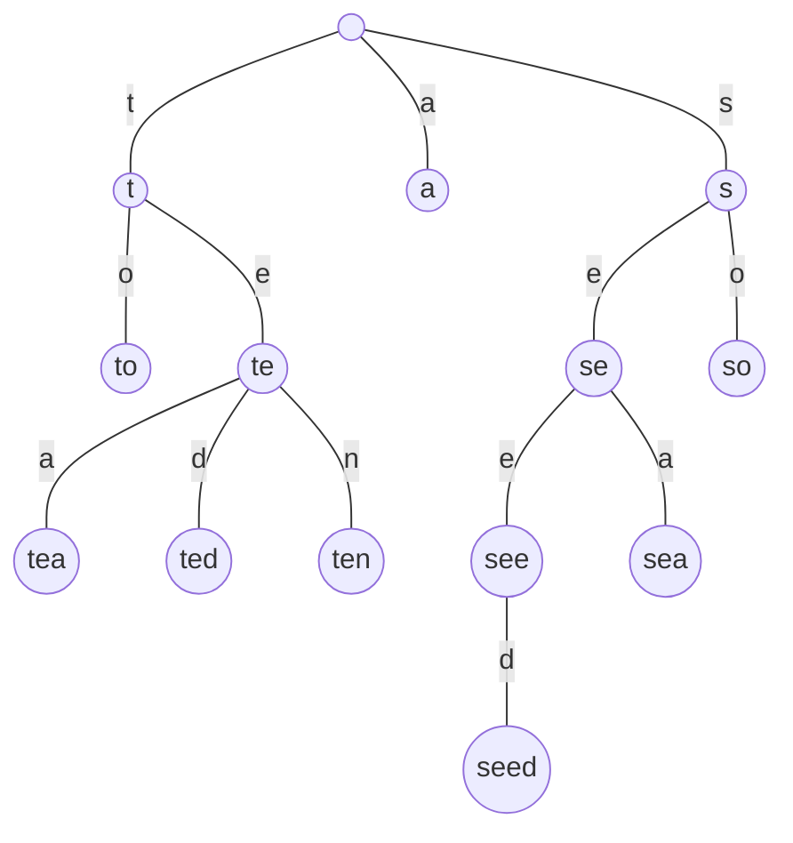
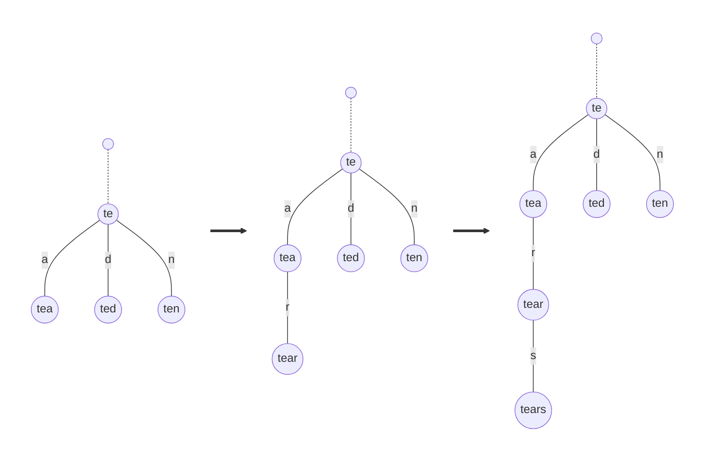
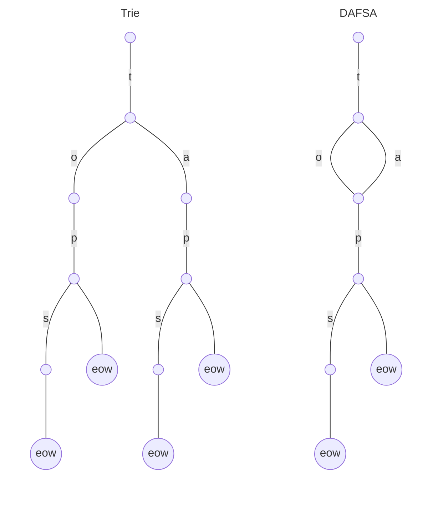

# Algorithm

- [Algorithm](#algorithm)
  - [Design principles and clarification](#design-principles-and-clarification)
    - [Why arrays and binary search are not a good solution](#why-arrays-and-binary-search-are-not-a-good-solution)
    - [Tries](#tries)
  - [Specification](#specification)
    - [Structure](#structure)
    - [Insertion](#insertion)
    - [Searching for words that match the prefix](#searching-for-words-that-match-the-prefix)
  - [Soft spots and possible improvements](#soft-spots-and-possible-improvements)
    - [Memory optimization](#memory-optimization)
    - [Concurrency and race conditions](#concurrency-and-race-conditions)
    - [Support for non-latin alphabets](#support-for-non-latin-alphabets)
      - [Ligatures and linking letters in the Arabic alphabet](#ligatures-and-linking-letters-in-the-arabic-alphabet)
      - [No indicator for the end of a word in the Japanese writing system](#no-indicator-for-the-end-of-a-word-in-the-japanese-writing-system)
    - [Typos and scoring system](#typos-and-scoring-system)

---

This repository consists of a PoC version of a word autocompletion algorithm.
I utilizes tries (prefix trees) as a data structure to store a dictionary defined by the user.

Please note that this is rather a MPV version, not a fully optimized end product.
Nevertheless, the algorithm is design with a robustness and efficiency in mind.

## Design principles and clarification

The problem of autocompletion can be brought down to a difficulty of finding a subset of all the elements in a set of words (a dictionary), such that they start with a user-specified prefix.

In other words, having a sorted dictionary, the goal is to final all the words that either equal or are below the first occurrence of the prefix in the list, but at the same time are above the first word that starts with a successive letter of the alphabet. The example below shows entries of a dictionary with marked subset for the prefix `b`.

```
⋮
alcohol
amaretto  ___
bartender   ¦
beer        ¦
booze       ¦
brewing     ¦
champagne ¯¯¯
cider
⋮
```

### Why arrays and binary search are not a good solution

The naive approach would be to store all words given by the user in a sorted array and then iterate through them to find the first occurrence of the prefix, save the word's index in the memory and iterate a little more to find a position of a word that starts with the next letter of the alphabet.
This determines the algorithm's computational complexity as $O(n)$.

Considering only English, there are dictionaries of almost 1.5 million words. It means that every time the user types a letter, the autocompletion algorithm would have to iterate up to 1.5 million entries. This process would consume an enormous amount of time - it is very likely that by the time the algorithm returns completions, the user will type the full word by their own, which makes the whole process completely unnecessary.

The number of iterations can be drastically reduced in several ways. The first one consists of saving metadata about the dictionary, especially positions of first words that start with successive letters of the alphabet.
This method reduces the set of words to loop through

The other method decreases the number of iterations, but in contrast to the previous one, leaves dictionary and its metadata unchanged. As the array is already sorted, binary search can be applied. It not only reduces the computational complexity to $O(\log n)$, but together with the first method makes finding a subset relatively fast when comparing to the $O(n)$ solution.

Sadly, there is a catch. Inserting a new word in the middle of the array requires shifting from this point all elements by one. This can be omitted by using a linked list instead of a traditional array, but binary search won't work anymore.

In fact, even sorting the array is a huge challenge. It is decent with the English alphabet and ASCII characters, but Unicode and non-English alphabets can make it really tough.
Thus, a vicious circle is established which leads to giving a try at another data structure.

### Tries

A trie (or a prefix tree) is a type of the search tree data structure. Its main purpose is locating the specific string from within a set. Links between nodes are defined by individual characters. The graph below is an example of a trie for elements `a`, `to`, `tea`, `ted`, `ten`, `so`, `see`, `sea` and `seed`.

<center>



</center>

In the example above, to find all words with the prefix `te`, the first thing to do is to is to go from the root to the `te` node via `t` and `e` edges and traverse through the rest of its edges.

Inserting new nodes is equally simple. In the first place, it is going from the root down the trie via edges corresponding to the word's consecutive characters. If characters mismatch or there are no more edges, a new node is added that represents the next character of the word. The example below shows insertion of a word `tears` to a part of the trie above.

<center>



</center>

Tries have many advantages over the array. Node lookup speed in the worst case takes $O(N)$ time, where $N$ denotes the total number of nodes.

## Specification

### Structure

The trie is built from the nodes connected with each other by edges. Each node contains two elements - an array or map of pointers to children nodes and a `end of word` indicator.

```go
type node struct {
    children []map[rune]*node
    eow      bool
}
```

All nodes, including the root node, are initialized with empty map and `eow` set to `false`.

```go
func newNode() *node {
    return &node{
        children: make(map[rune]*node),
        eow:      false,
    }
}
```

### Insertion

The process of inserting a new word to the trie is identical for all nodes, despite it would be very likely perform only on the root node.

The procedure starts from iterating through characters of the word that would be inserted to the dictionary. Inside the loop, the algorithm checks if the letter of the word, corresponding to the current number of iteration cycles, maps to another node. If not, a new node is added to make the previous statement true for the future checks. Finally, at the end of the iteration the node on which the insertion is performed is changed to its child node, either freshly created in the previous step or existing before.

When the loop breaks, the final operation is to set the `end of word` indicator of the last node to `true`.

```go
func (n *node) insert(key string) {
	for _, r := range key {
		if _, ok := n.children[r]; !ok {
			n.children[r] = newNode()
		}

		n = n.children[r]
	}

	n.eow = true
}
```

### Searching for words that match the prefix

Searching process is divided into two parts. The first one is in many ways similar to the operation of insertion, but in the place of new node creation, the functions returns a null array. When the loop ends with no early returns, this means that there is almost one word that matches the prefix.

At this point, the only thing left is to traverse through children nodes and append all matches to the array of results. This can be done is many ways, both recursively and iteratively, depending on the requirements of the implementation.

```go
func (n *node) search(key string) []string {
	for _, r := range key {
		if _, ok := n.children[r]; !ok {
			return nil
		}

		n = n.children[r]
	}

    if n.eow {
		return append(n.traverse(key), key)
	}

	return n.traverse(key)
}

func (n *node) traverse(prefix string) (results []string) {
	for key, node := range n.children {
		if node.eow {
			results = append(results, prefix+string(key))
		}

		results = append(results, node.traverse(prefix+string(key))...)
	}

	return results
}
```

## Soft spots and possible improvements

The implementation of autocompletion with a trie data structure is relatively efficient and robust. However, there is still room for improvement.

### Memory optimization

For words with many common prefixes, the dictionary stored in a trie takes significantly less space then the standard array. Nonetheless, this still can be improved in various ways, especially for larger set of words.

The algorithm can consume less memory by utilizing deterministic acyclic finite state automatons (DAFSA), also know as direct acyclic word graphs (DAWG).
Its main advantage is an ability to reduce required space in the memory by reusing common suffixes. The example below shows a trie and the DAFSA structure for keys `tap`, `taps`, `top` and `tops`.

<center>



</center>

Normally, this structure would be constructed form already existing tries by transforming them with an algorithm suitable for the use case and implementation. One of the most popular are Hopcroft algorithm and the newer, designed with DAWG in mind Blitzkrieg Attack algorithm. Then, the procedure of insertion and searching would remain the same, as for the normal trie.

### Concurrency and race conditions

The process of inserting by the end user a word to a dictionary in normal conditions would be a synchronous operation. This changes when the dictionary is built automatically and asynchronously, for example while parsing user's text input.

In such case, there is a small chance that the word wouldn't be added to the dictionary by the time user types its prefix. It is very likely, that in the production-ready autocompletion system this situation can be neglected as the process of insertion is fast enough to make this coincidence very rare for the user to notice the deficiency.

A good idea would be to implement a feature for cancelling asynchronous search calls when the result is retrieved slower than the speed of user typing new words.

### Support for non-latin alphabets

The algorithm has comparatively rich support for languages that uses extended latin alphabets. More exotic grammars and phonetic systems might require resolving related to them edge cases. Below, there are few examples I can think of with my modest linguistic knowledge.

#### Ligatures and linking letters in the Arabic alphabet

In the Arabic writing systems, characters typed one after another can combine to a ligature which is represented by the single character. Fortunately, Unicode seems to be constructed in way that makes easier predicting possible ligatures.

It is worth mentioning, that words in the Arabic and Hebrew alphabets are written mostly from right to left. The algorithm for these languages would stay the same but words probably have to be inserted to the dictionary backwards.

#### No indicator for the end of a word in the Japanese writing system

In Japanese, words aren't separated from each other with a space. This makes really hard to determine from which point the sequence of characters should be treated as a prefix of the next word. This challenge may be attacked with probability and advanced natural language processing techniques.

### Typos and scoring system

When the user types really fast, there is a chance of appearance of a typo. Spell-checkers and autocompletion algorithms can take it into account with computing a Levenshtein distance, performing a Wagner-Fisher algorithm or even implementing a simple probability-based Peter Norvig’s spelling corrector.

Some words are more likely to type then other, so a scoring system can be developed for better predictions. Then, the list of results can be sorted for the most frequent or likely completion to the less used words. Scoring can varying because of the user personal style of writing and vocabulary range. Building such a system is a huge challenge that can be approached with tools of natural language processing and neural networks.
